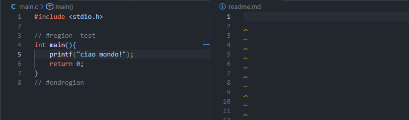
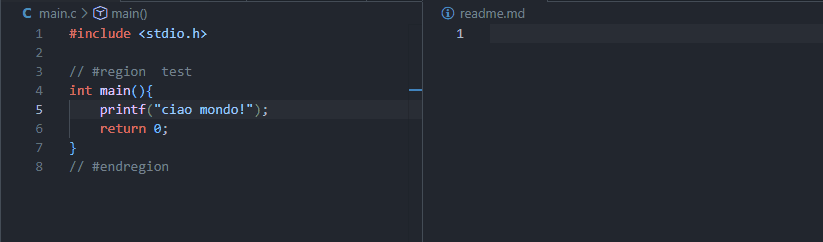
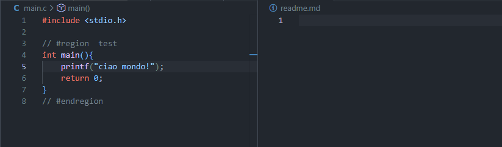
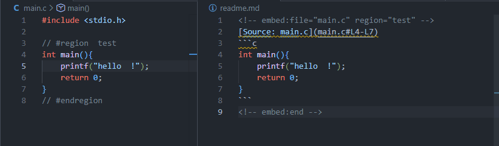
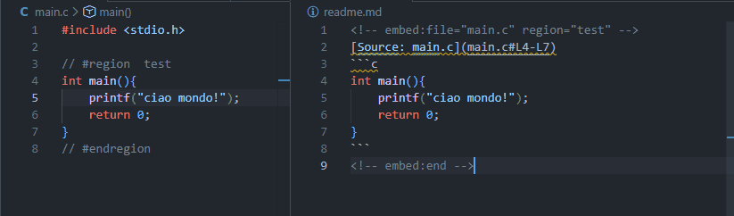
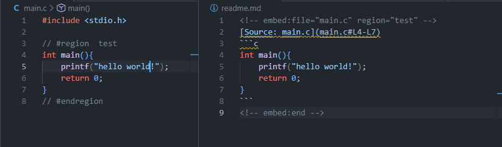

<p align="center">
  
</p>

# Markdown Code Embedder

<p align="center">
    <a href="https://marketplace.visualstudio.com/items?itemName=giob22.markdown-code-embedder">
        
    </a>
    <a href="https://marketplace.visualstudio.com/items?itemName=giob22.markdown-code-embedder">
        
    </a>
    <a href="https://marketplace.visualstudio.com/items?itemName=giob22.markdown-code-embedder">
        
    </a>
    <br />
    <a href="LICENSE">
        
    </a>
    <a href="https://github.com/giob22/Markdown-Code-Embedder">
        
    </a>
    <a href="https://github.com/giob22">
        
    </a>
</p>

<p align="center">
    <b>Stop copy-pasting code! Keep your documentation in perfect sync with your source.</b>
</p>

---

## 💡 Why Markdown Code Embedder?

Documentation gets stale fast. You change a function name in your code, but forget to update the README. Before you know it, your docs are misleading.

**Markdown Code Embedder** solves this instantly. Instead of pasting code snippets, you reference your **actual source files**.
When your code changes, your documentation updates automatically. It's like magic for your technical writing.

### Key Benefits
- 📚 **Single Source of Truth**: Your codebase _is_ your documentation.
- ⚡ **Zero Maintenance**: Never worry about outdated examples again.
- 🎯 **Precision & Control**: Embed entire files, specific regions, or exact line ranges.
- 🔒 **Lock Mode**: Need a static snapshot? Lock specific embeds to prevent updates.
- 🔴 **Instant Feedback**: Errors surface right in the editor — no surprises at save time.

---

## ✨ Features

- **Dynamic Embedding**: Reference code from any file in your workspace seamlessly.
- **Smart Region Support**: Define named regions (`#region ... #endregion`) in your source code — the **most robust** way to embed snippets as they survive refactoring and line shifts.
- **Line Range Support**: Quickly grab lines 10–20 for a fast example.
- **Auto-Sync**: Enable `autoUpdate` to have your docs refresh the moment you save your source file.
- **Source Links**: Automatically generates clickable links to the source file and line numbers.
- **Intelligent Syntax Highlighting**: Detects the source language and applies the correct markdown code fence.
- **Diagnostics**: Red squiggles appear instantly when a referenced file is missing or a region can't be found.
- **CodeLens**: Inline action buttons above every embed — update, navigate, lock/unlock without touching the tag.
- **Hover Preview**: Hover over an embed tag to preview the code without opening the source file.
- **Autocomplete**: IntelliSense for file paths and region names while writing embed tags.
- **Remote Embeds**: Embed code directly from any HTTP/HTTPS URL (e.g. GitHub raw links).
- **Copy Embed Tag**: Right-click any source file selection to generate an embed tag and copy it to the clipboard.
- **Update Workspace**: One command refreshes every embed in every Markdown file in the workspace.
- **Stale Detection**: `⚠ Stale` CodeLens badge appears whenever the source has changed but the embed hasn't been updated yet.
- **Indent**: `indent="N"` shifts the entire generated block (link + code fence) by N spaces — useful inside lists or admonitions.
- **Strip Comments**: Region marker lines (`#region`/`#endregion`) are hidden by default. Set `strip-comments="false"` to keep them visible.

---

## 🚀 Usage

### 1. Embed an Entire File
Use the `embed:file` comment to embed the full content of a file. The path can be relative to the markdown file.



```markdown
<!-- embed:file="./src/main.ts" -->
```

### 2. Embed a Named Region (Recommended)
Regions are the most robust way to embed code. They stay correct even if you add code above or below the block.



**In your source code:**
```typescript
// #region my-feature
function calculate() {
    return 42;
}
// #endregion
```

**In your markdown:**
```markdown
<!-- embed:file="./src/main.ts" region="my-feature" -->
```

### 3. Embed by Line Numbers
Useful for quick, temporary references.



```markdown
<!-- embed:file="./src/main.ts" line="5-10" -->
```

### 4. Highlight Specific Lines
Mark important changes using the `new` attribute. Supports single lines and ranges.

```markdown
<!-- embed:file="./src/main.ts" region="my-feature" new="2,3-5" -->
```

Appends `// NEW` (or language-equivalent comment) to the specified lines, vertically aligned.

### 5. Show Line Numbers
Prefix each line with its original line number from the source file.

```markdown
<!-- embed:file="./src/main.ts" line="10-12" withLineNumbers="true" -->
```

Output:
```typescript
10: const x = 10;
11: const y = 20;
12: console.log(x + y);
```

### 6. Lock an Embed
Prevent an embed from updating by adding `lock="true"`.



```markdown
<!-- embed:file="./src/main.ts" lock="true" -->
```

### 7. Automatic Updates (Auto-Sync)
Enable `markdownEmbedder.autoUpdate` to have your markdown files automatically update whenever you save a referenced source file.



### 8. Manual Updates
Run the command `Markdown Embedder: Update Code Embeds` or simply save the markdown file.



### 9. Update All Embeds in Workspace
Run `Markdown Embedder: Update All Embeds in Workspace` to refresh every embed across all Markdown files in the project at once.

### 10. Embed from a Remote URL
Reference any public HTTP/HTTPS URL. Supports region and line range attributes as usual.

```markdown
<!-- embed:file="https://raw.githubusercontent.com/user/repo/main/src/main.ts" region="my-feature" -->
```

### 11. Copy Embed Tag from Source
Right-click any selection (or cursor position) inside a source file and choose **Copy Embed Tag**. The tag is copied to the clipboard, ready to paste into your Markdown document.
- If the cursor is inside a `#region` block, the tag uses `region="name"`.
- If lines are selected, the tag uses `line="start-end"`.

### 12. Indent Embedded Block
Use `indent="N"` to prefix every output line (link + code fence) with N spaces. Useful when embedding inside Markdown lists.

```markdown
- Here is an example:

<!-- embed:file="./src/main.ts" region="example" indent="2" -->
```

### 13. Strip Region Marker Comments
Region marker lines (`// #region` / `// #endregion`) are **hidden by default** — they never appear in the embedded output. To include them, set `strip-comments="false"`.

```markdown
<!-- embed:file="./src/main.ts" region="my-feature" strip-comments="false" -->
```

This also applies to full-file and line-range embeds: any `#region`/`#endregion` lines within the selected range are stripped unless `strip-comments="false"` is set.

---

## 🧠 Smart Editor Features

### Diagnostics
The extension highlights problems directly in the editor as you type:

| Problem | Severity |
| :--- | :--- |
| Referenced file not found | Error |
| Named region not found in file | Error |
| Invalid line range format | Warning |
| Line range exceeds file length | Warning |

### CodeLens
Every embed tag shows inline action buttons:

- **↻ Update** — refresh this single embed without running the full update command
- **→ file#region** — jump directly to the source file (and region, if specified)
- **🔒 Lock / 🔓 Unlock** — toggle update protection with one click

### Hover Preview
Hover over any `<!-- embed:... -->` tag to see a popup preview of the embedded code. Useful for quickly checking what will be inserted without opening the source file.

### Autocomplete
IntelliSense activates automatically inside embed tags:

- **`file="..."`** — suggests files and folders relative to the current markdown file
- **`region="..."`** — lists all `#region` names found in the referenced source file

---

## ⚙️ Configuration

| Setting | Default | Description |
| :--- | :--- | :--- |
| `markdownEmbedder.autoUpdate` | `false` | Automatically update embeds when a referenced source file is saved. |

## ⌨️ Commands

| Command | Description |
| :--- | :--- |
| `Markdown Embedder: Update Code Embeds` | Update all embeds in the current markdown file. |

## 📝 Supported Region Markers

The extension supports various comment styles, accommodating most languages:

- `// #region name` ... `// #endregion` (JS, TS, C#, Java, etc.)
- `#region name` ... `#endregion` (Python, Shell, etc.)
- `/* #region name */` ... `/* #endregion */` (CSS, C, etc.)
- `<!-- #region name -->` ... `<!-- #endregion -->` (HTML, XML)

---

## 🤝 Contributing

Found a bug or have a feature request? Please open an issue on our [GitHub repository](https://github.com/giob22/Markdown-Code-Embedder).

## ❤️ Support the Efficiency
If you find **Markdown Code Embedder** useful, please consider:

- ⭐ **Starring** the repository on [GitHub](https://github.com/giob22/Markdown-Code-Embedder)
- ✍️ **Leaving a review** on the [Visual Studio Marketplace](https://marketplace.visualstudio.com/items?itemName=giob22.markdown-code-embedder)
- 🐛 **Reporting issues** to help us improve!

Your feedback is what keeps this tool growing. Thank you!

## 📄 License

MIT
